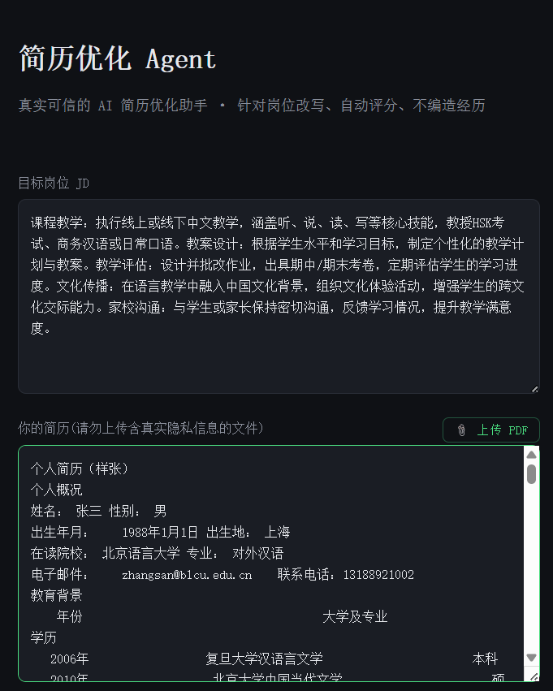
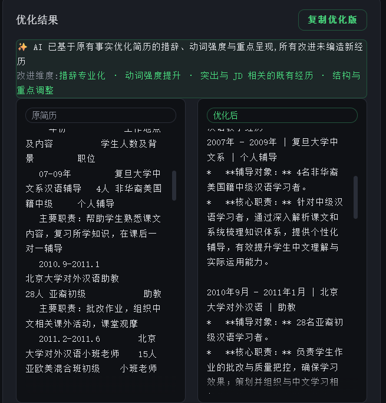
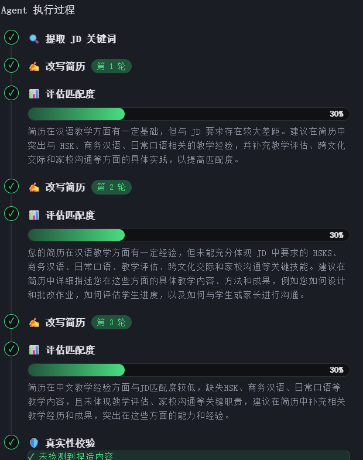

# 🎯 Resume Tailor Agent

An AI-powered resume optimization platform built with Next.js, LangGraph, and LangChain.

The application analyzes resumes against job descriptions, optimizes wording under strict anti-hallucination constraints, and provides objective match-rate scoring with transparent feedback.

## 🧠 Workflow

```text
Extract Keywords
       ↓
Rewrite Resume
       ↓
Score Resume
       ↓
Retry if Score < 85 (max 3 rounds)
       ↓
Verify (Optional)
       ↓
Done
```


## 🚀 Tech Stack

| Layer           | Technology               |
| --------------- | ------------------------ |
| Framework       | Next.js 16 (App Router)  |
| Frontend        | React 19                 |
| Styling         | Tailwind CSS v4          |
| AI Framework    | LangChain                |
| Agent Framework | LangGraph                |
| Model           | Gemini 2.5 Flash-Lite    |
| Streaming       | Server-Sent Events (SSE) |
| Validation      | Zod                      |
| Language        | TypeScript               |


## 🔧 Technical Highlights

* LangGraph self-reflection workflow with conditional retry
* Graceful degradation when API quota is exhausted
* Two-layer anti-hallucination defense (prompt constraints + verification node) to prevent AI from fabricating resume experiences.
* Tool-based architecture for keyword extraction and coverage calculation
* Type-safe LLM responses using Zod and Structured Output
* Real-time agent visualization via Server-Sent Events (SSE)
* Multilingual support (English / Japanese / Chinese)

## 📸 Screenshots

### Resume Input



### Optimization Result



### Agent Execution Flow



## Project Status

This project is mainly for portfolio and technical demonstration purposes.

The application demonstrates AI agent orchestration, resume optimization workflows, and anti-hallucination strategies using LangGraph and LangChain.

Screenshots are included to demonstrate the main UI and application flow.

## 🌐 Demo

Live Demo:

https://resume-tailor-theta-three.vercel.app/

## ⚠️ Known Issues

### Gemini Free Tier Limits

The application handles API quota limitations through retry strategies and graceful degradation.

### PDF Parsing Compatibility

LangChain's PDFLoader currently requires:

pdf-parse@1.x

This dependency is pinned via package overrides.
